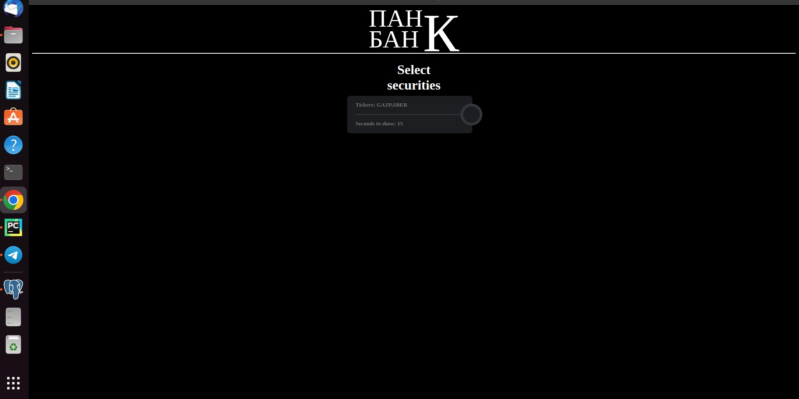
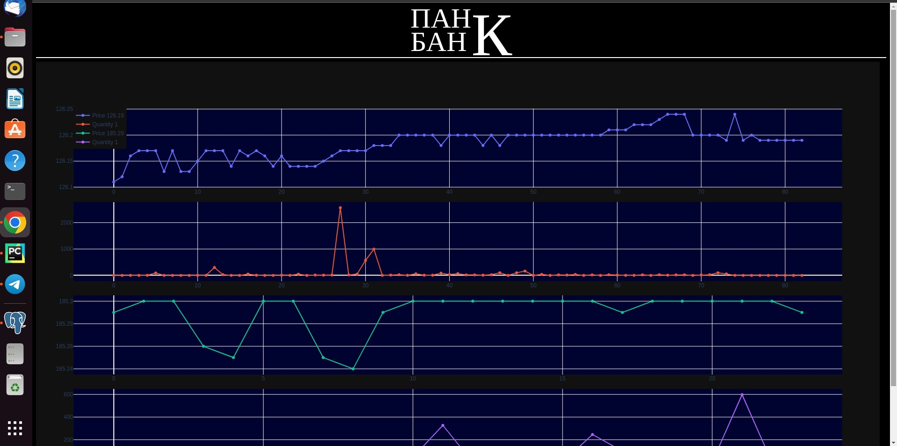

# Securities dealing

The program displays security quotes in real time. To run this program you need to download
file and install all used libraries, also you need to add token_file in your program
it is file that contain token from tinkoff-invest-api.
After that, you will need to run main.py, and go to the site where you can choose tickers of 
companies and seconds for graph displaying.  
If you enter the data correctly and click on the button, you will see the dynamic graph 
with the latest transactions and their quantity, like on the screen below.

In the future I will add DB for saving info, better visual design and add 
machine learning algorithms to analyse price movement.
