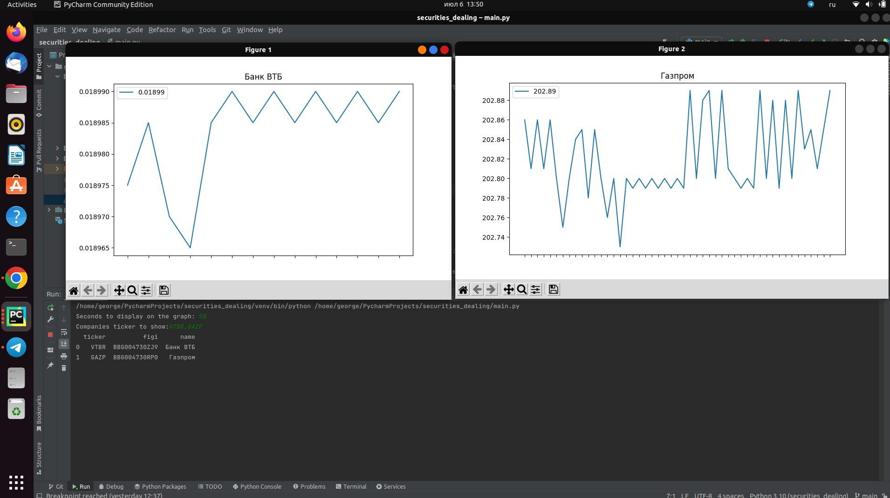

# Securities dealing

The program displays stock quotes in real time. To run this program you need to download
file and install all used libraries.
After that, you will need to run main.py, it will ask you limit of displaying seconds
and ticker of the companies you want to see. You will see the dynamic graph 
with tick-by-tick price, like on the screen below. 
In the future I will add it on the site with visual design and add 
machine learning algorithms to analyse price movement
